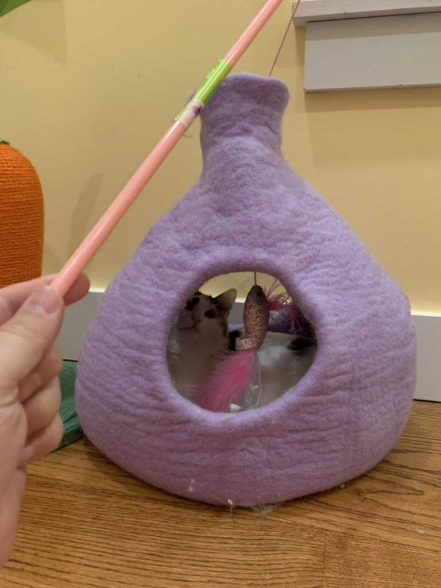
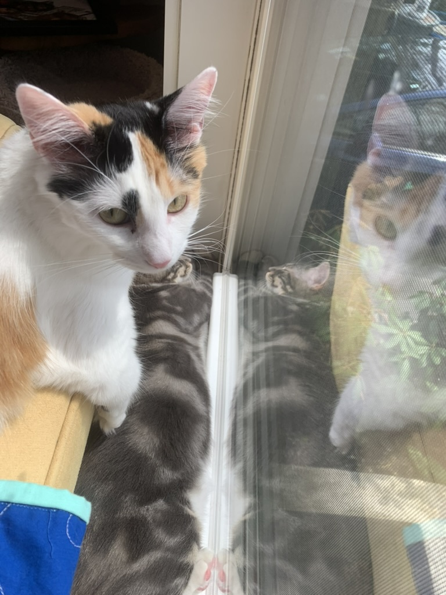
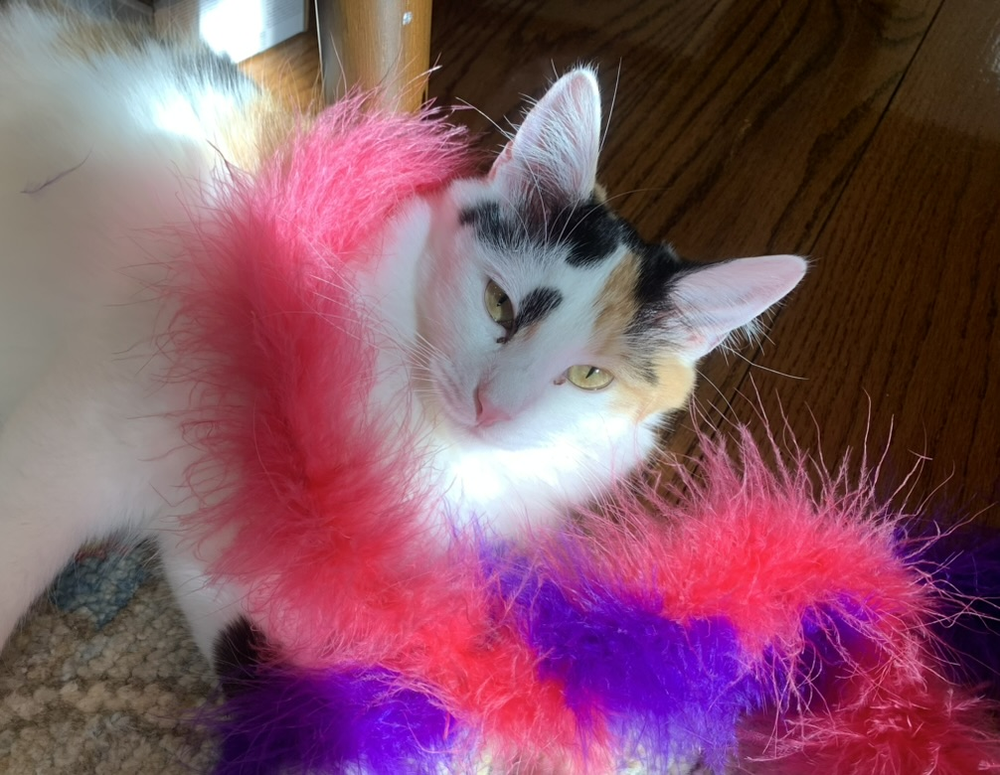
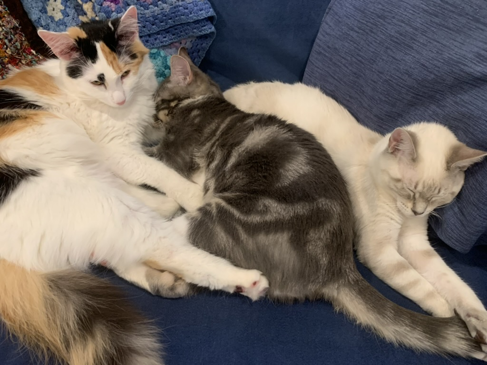
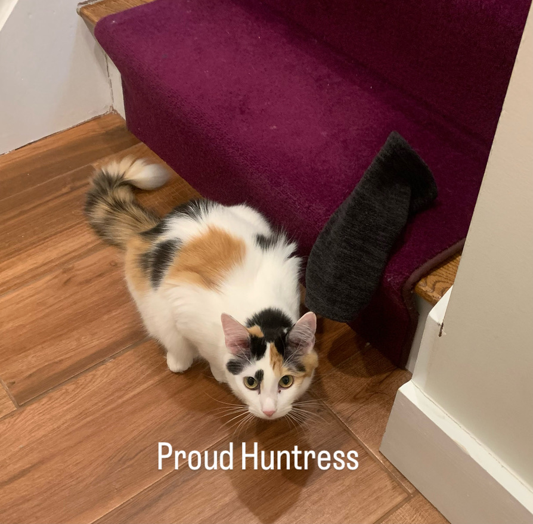

:::{#about}  
:::

Cleo arrived as a cute but very frightened floof. Fresh from an abandoned outdoor mall in Florida, she made bird-like meows (hunting?) but was scared of all contact.

::: {layout-ncol=2 layout-valign="center"}
{.lightbox width=100% group="cleo-gallery"}\

{.lightbox width=140% group="cleo-gallery"}\
:::

She has grown in boldness over time, and shown her true colors as a beast who knows when she wants pets, and will demand them. It helps that she sounds like a running diesel engine when she gets what she wants.

::: {layout-ncol=2 layout-valign="center"}
{.lightbox group="cleo-gallery"}\

{.lightbox group="cleo-gallery"}\

:::

Cleo has also shown herself to be a fierce hunter, with fingerless fleece gloves as her favorite prey item.

{.lightbox fig-align="center" width=50% group="cleo-gallery"}\
