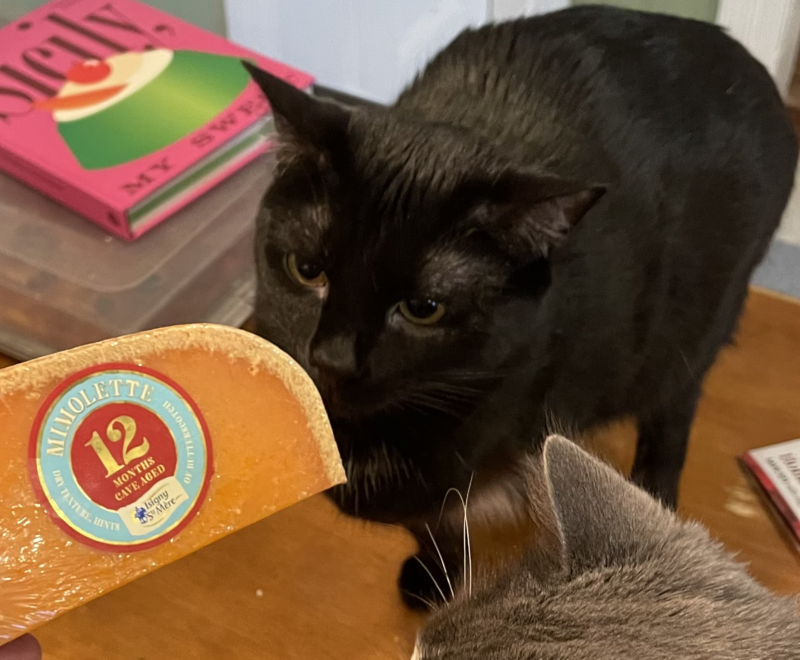
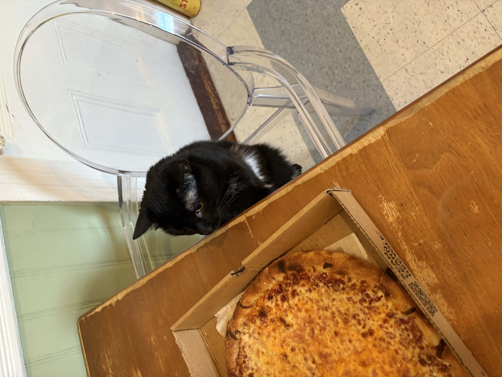
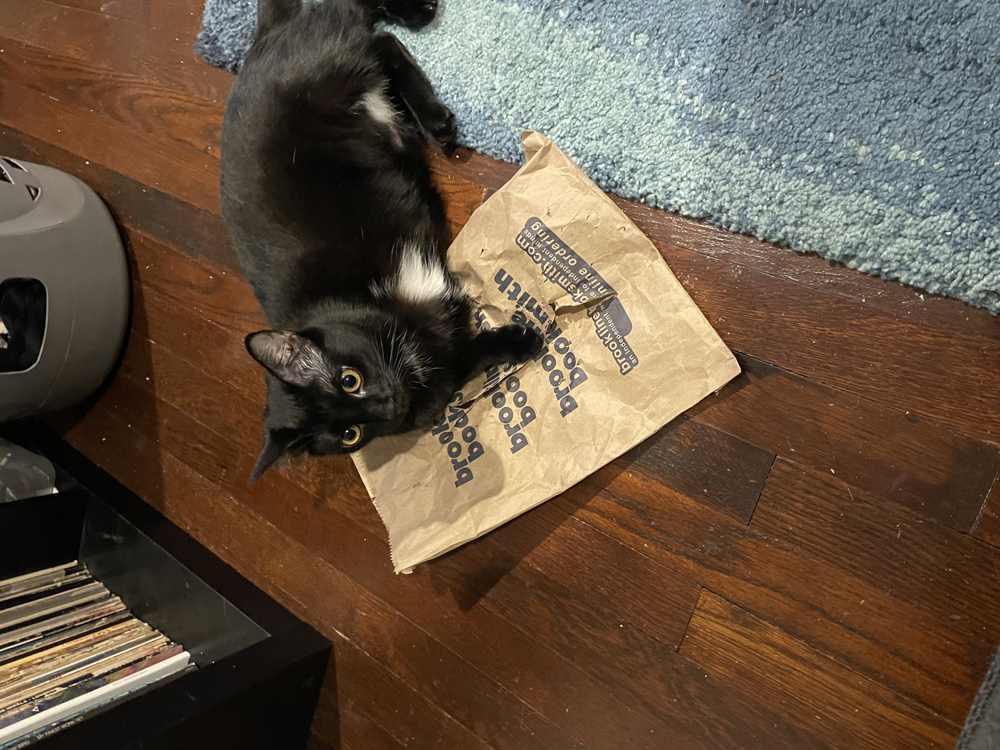
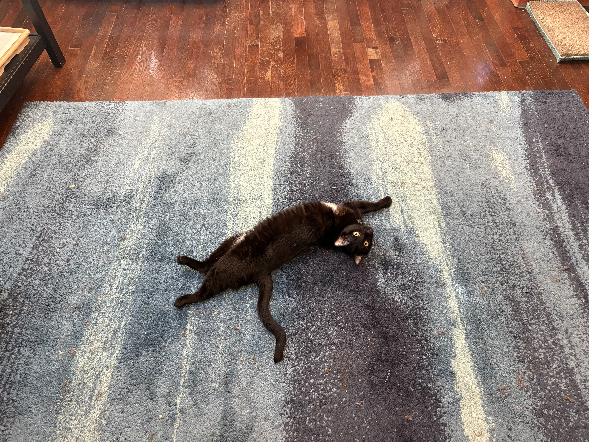
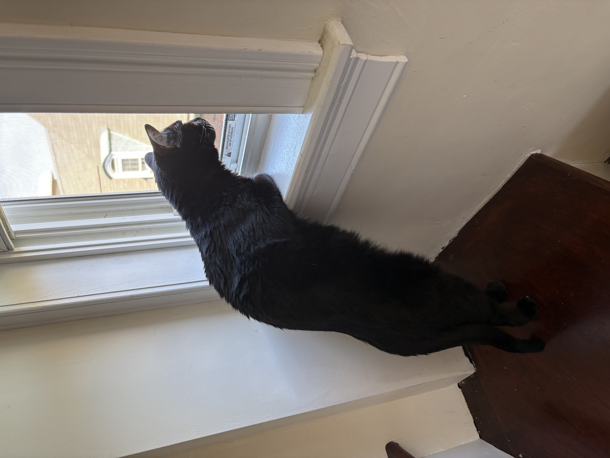
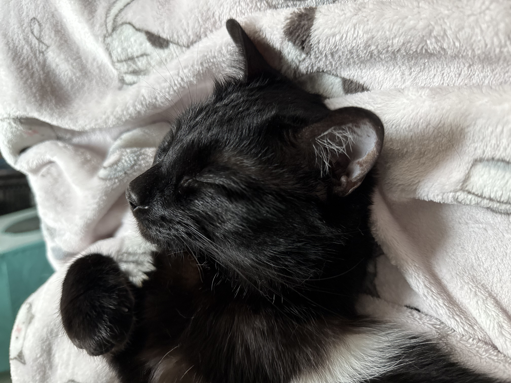
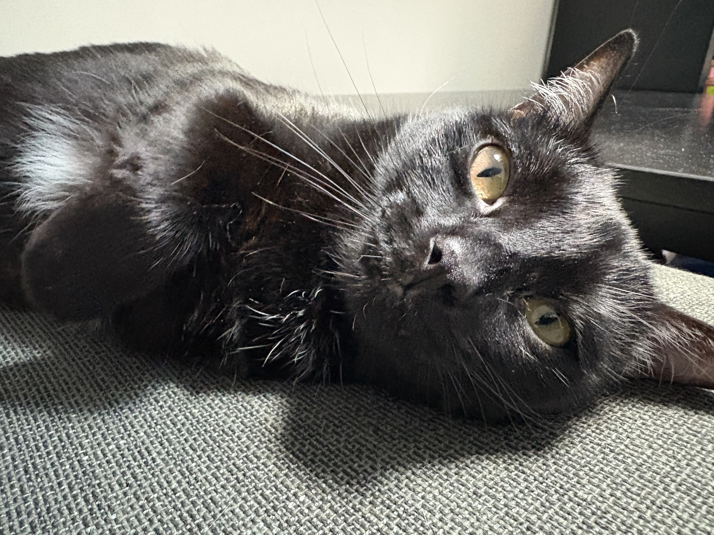
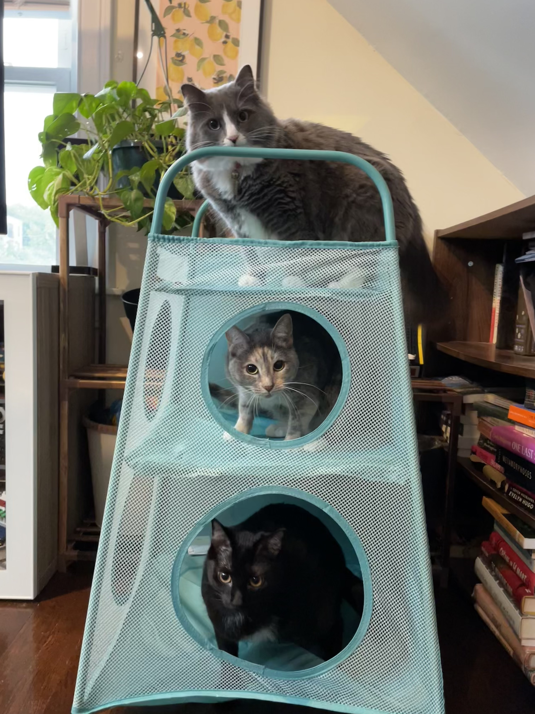

#### Mimo (Mimolette) is a tripod kitty who loves crunchy treats and a good paper bag

::: {.columns}
::: {.column width="40%"}
<figure>
  
  <figcaption style="text-align:center;">Pizza Mimo</figcaption>
</figure>
:::
::: {.column width="40%"style="margin-left: 10%;"}
<figure>
   <figcaption style="text-align:center;">she loves a crunchy bag</figcaption>
</figure>
:::
::: 

#### She enjoys rolling around and looking at birds through the window

::: {.columns}
::: {.column width="40%"}
<figure>
  
</figure>
:::
::: {.column width="40%"style="margin-left: 10%;"}
<figure>
  
</figure>
:::
:::

#### But her true passions are cuddling and sleeping in
::: {.columns}
::: {.column width="40%"}
<figure>
  
</figure>
:::
::: {.column width="40%"style="margin-left: 10%;"}
<figure>
  
</figure>
:::
:::

#### And spending time with her sisters 

