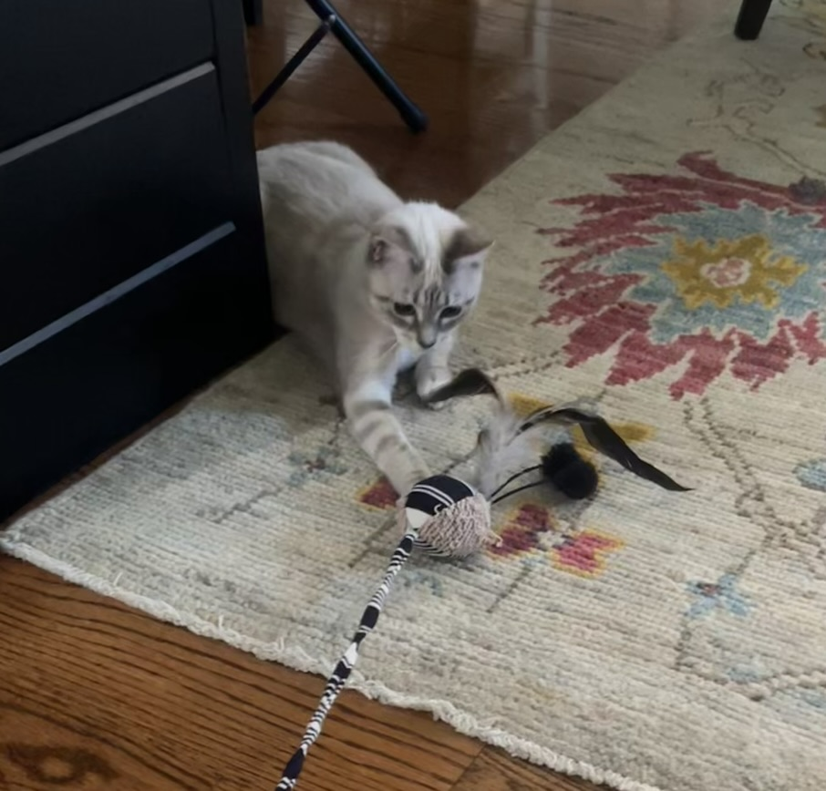
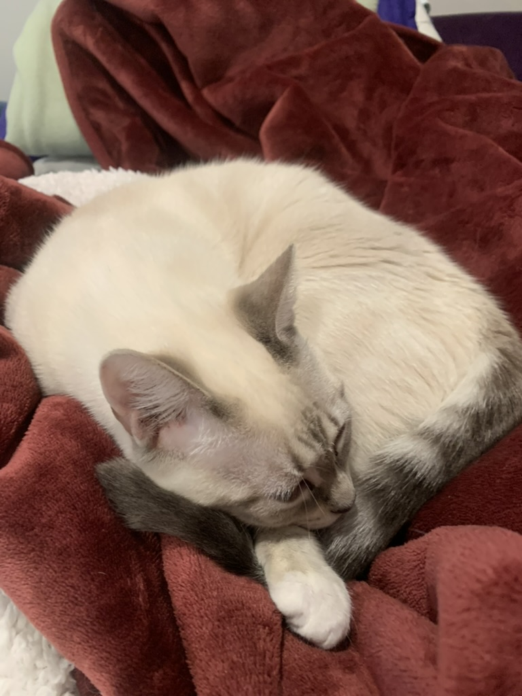
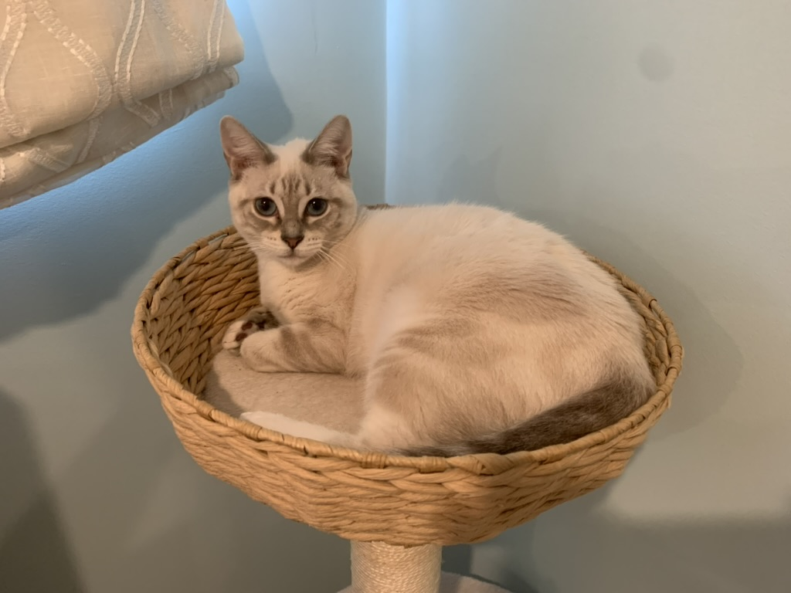
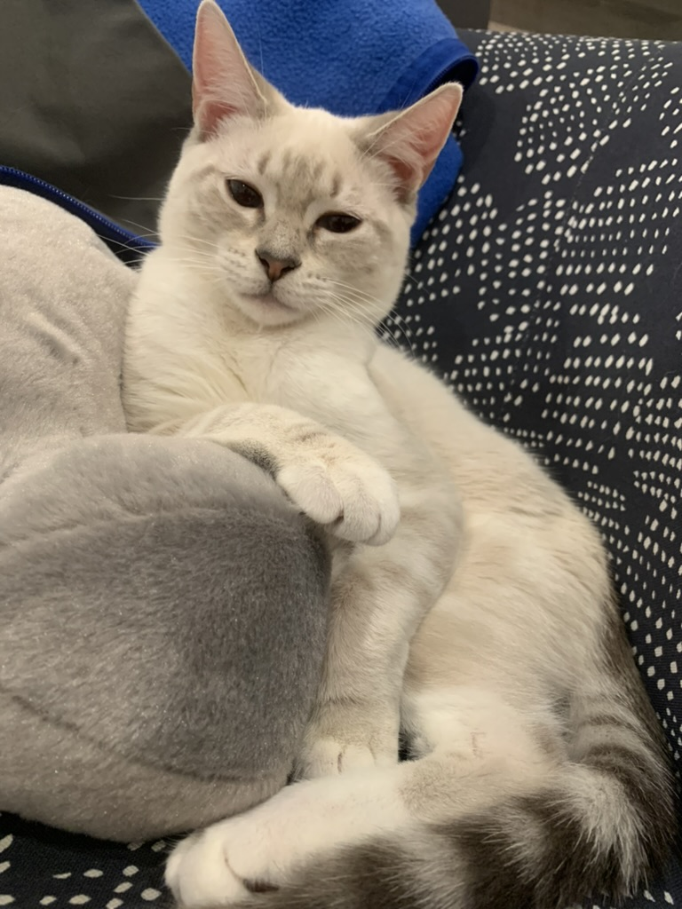

Pearl is a Barbarian. From moment one of arrival, she has been a barbarian - fierce in battle and fierce in love.

{.lightbox}

She's even fierce in immune system, having overcome feline leukemia when she was a kitten while staying isolated in Jarrett's daughter's room for three months.

::: {layout-ncol=2 layout-valign="center"}

{.lightbox}  

{.lightbox}

:::

Make no bones about it, if she wants something, she will yell at you and let you know. This little lynx-point wants you to pick her up and will tell you. Loudly.

{.lightbox width=80%}

Or nightly, she will demand to be put atop a bunk-bed to get roll around and purr louder than you ever thought as small a creature as her could purr. For she is a fierce barbarian, even when it comes to purring.

{.lightbox width=80%}