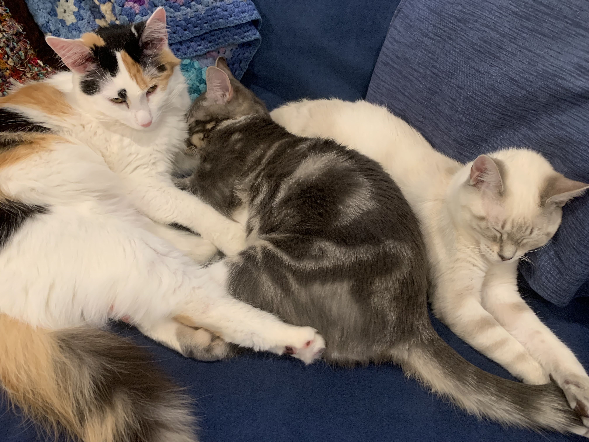
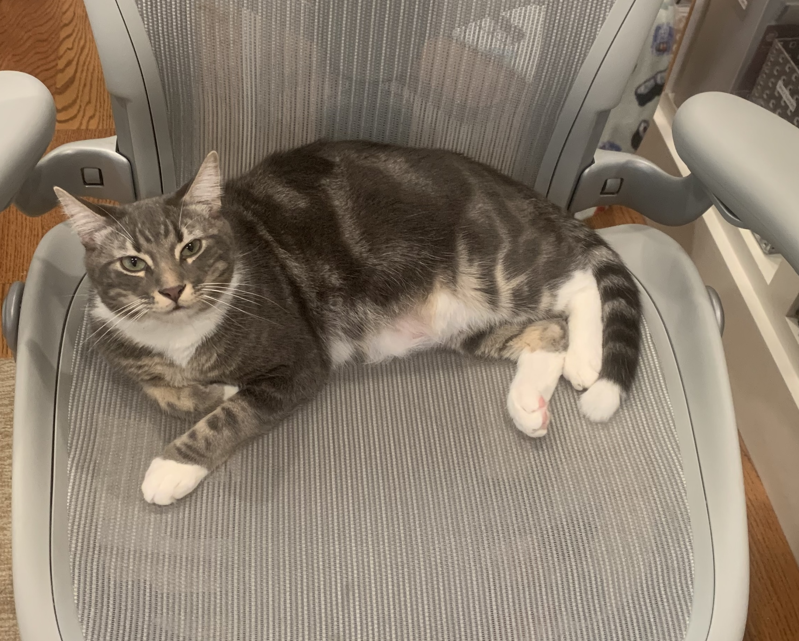
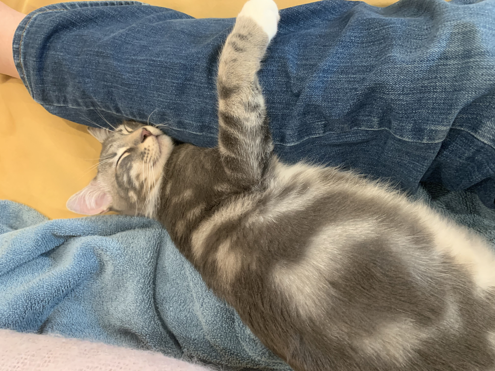
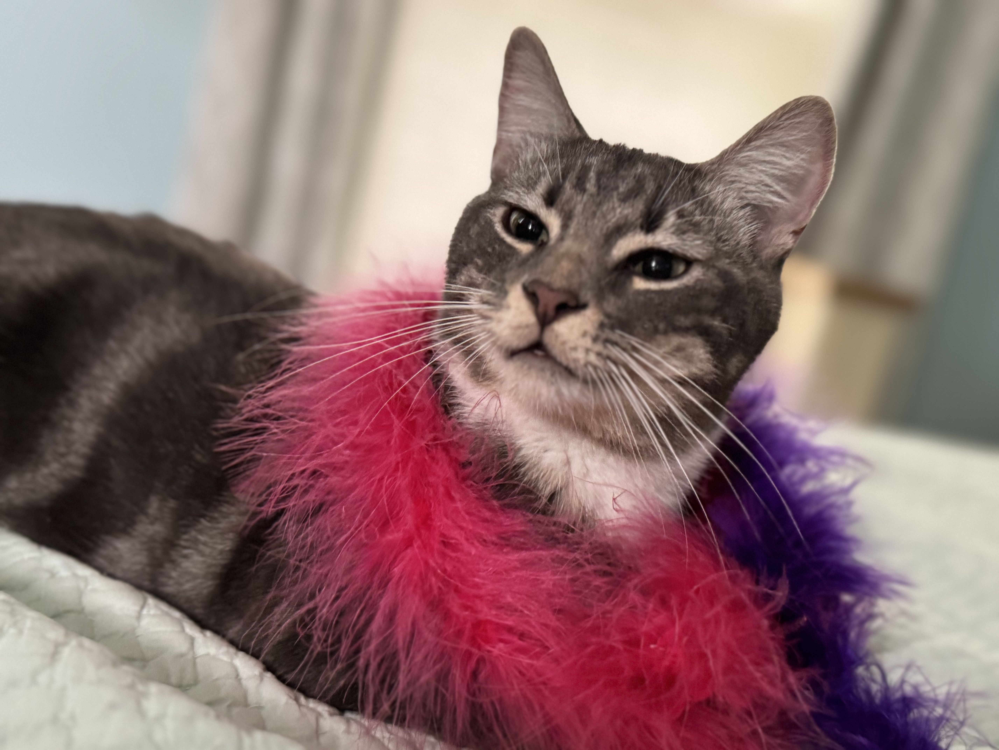

:::{#about}  
:::

Pepper is a spicy little man. He arrived as a kitten, and quickly showed he was more of a dog in a cat's body that anything else. He waited by the door for someone to come home, attached himself to anyone within eyesight, and even played fetch multiple times with my daughter.

{.lightbox width=100%}

He has continued to prove himself a cheeky little man, crying from several rooms away during Zoom meetings until someone comes and picks him up, waiting until you are done, and then taking over your chair when you get up for a moment. Or trapping you on a couch while he hugs you and passes out, so that you cannot move.

::: {layout-ncol=2 layout-valign="center"}
{.lightbox width=100%} 

{.lightbox width=100%}
:::

Such is the way of this little man, who is always there for you so that he knows you will be there for him. Just after he steals all of his siblings' food.

{.lightbox width=80%}
