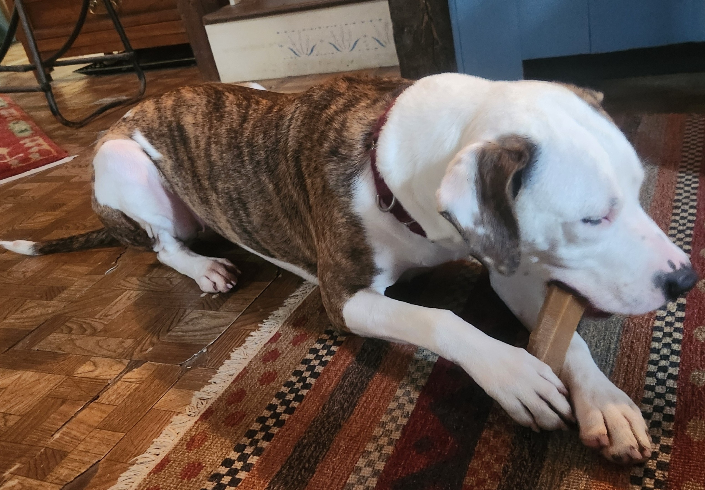
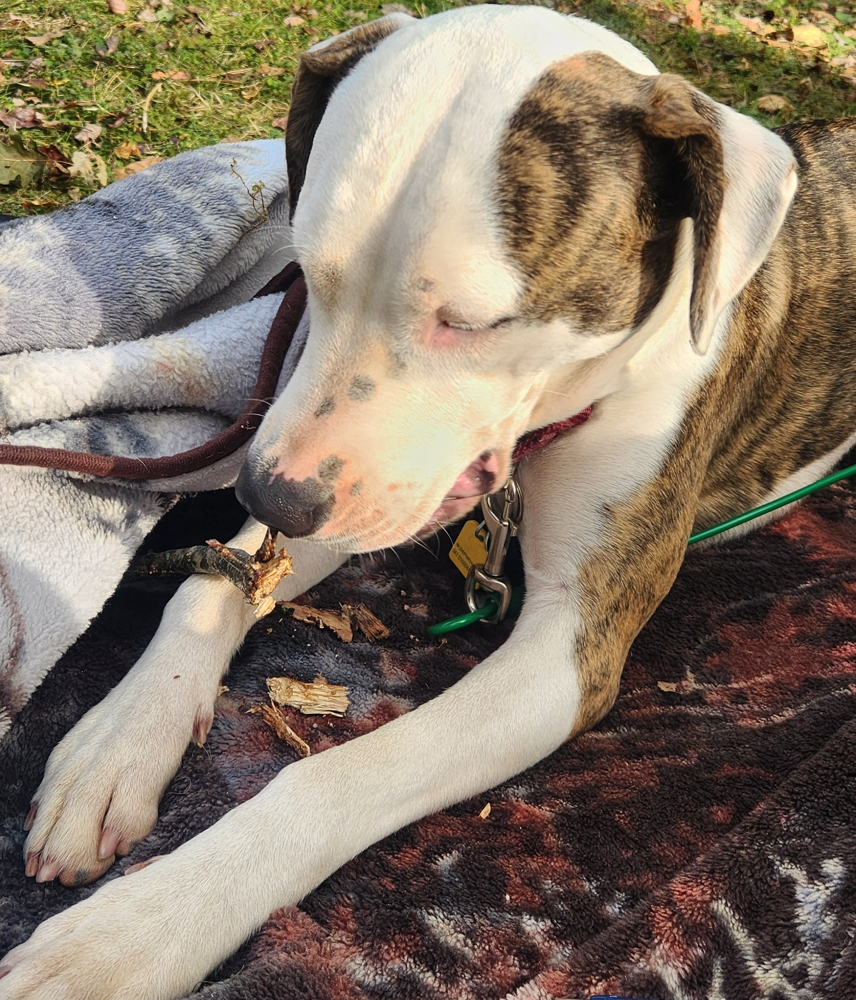
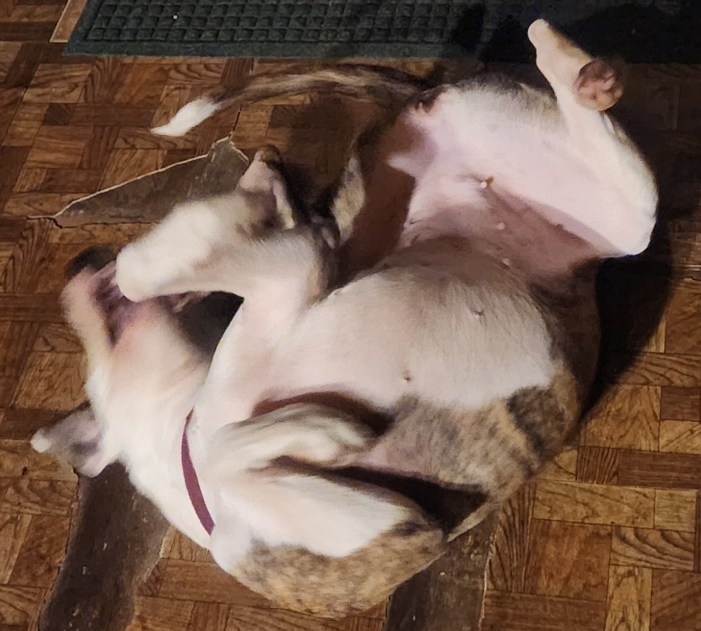
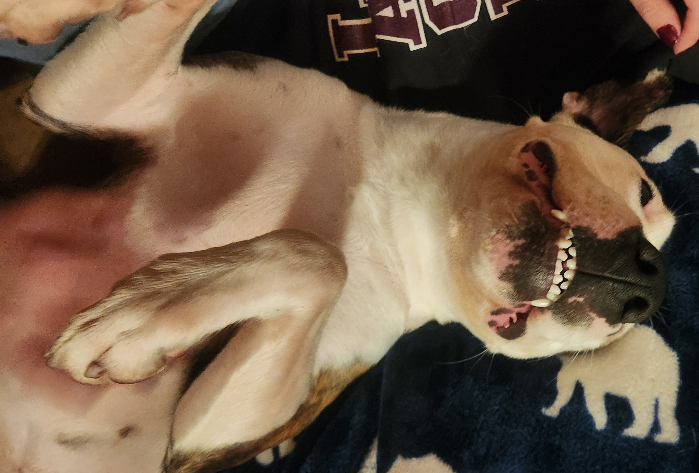
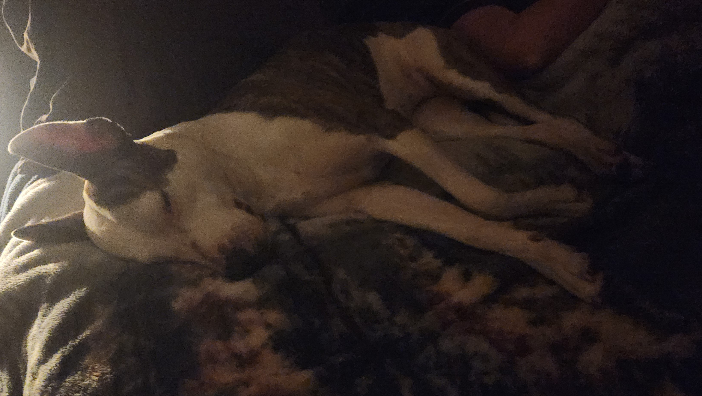
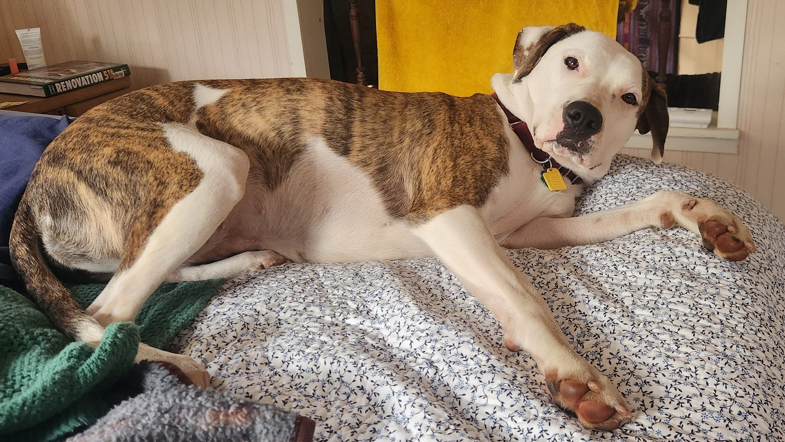
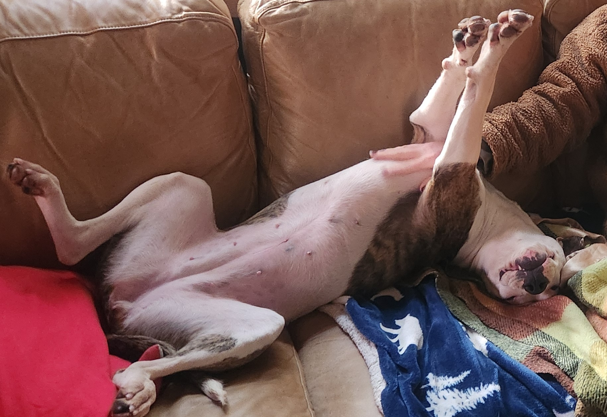
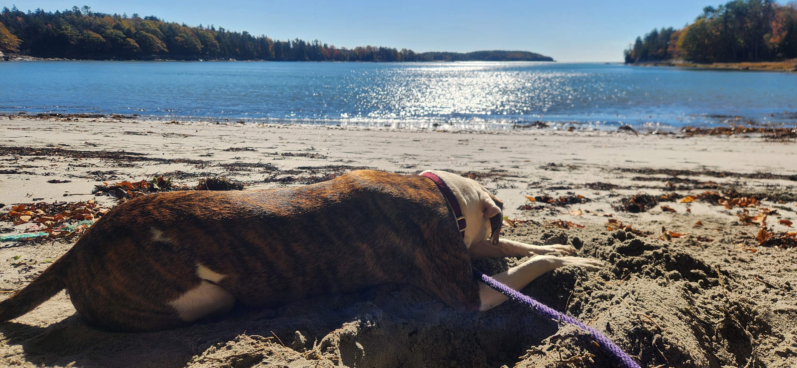

:::{#about} 

:::

Pierogi is a grade A snuggle-hound with penchants for sniffs, sticks, and squirrels.

::: {.columns}
::: {.column width="62.75%"}
{.lightbox width=100% group="pierogi-gallery"}\
:::
::: {.column width="37.25%"}
{.lightbox width=100% group="pierogi-gallery"}\
:::

When she's not learning new tricks Pierogi enjoys a good chew.

::: {.columns}
::: {.column width="43%"}
{.lightbox width=100% group="pierogi-gallery"}\
:::
::: {.column width="57%"}
{.lightbox width=100% group="pierogi-gallery"}\
:::
:::

Pierogi also enjoys the zoomies and love bombing to anyone who gets close.

::: {.columns}
::: {.column width="50%"}
{.lightbox width=100% group="pierogi-gallery"}\
:::
::: {.column width="50%"}
{.lightbox width=100% group="pierogi-gallery"}\
:::
:::

::: {layout-ncol=1 layout-valign="center"}
{.lightbox width=100% group="pierogi-gallery"}\
::: 

Of course, with all the zooming, Pierogi is sure to take plenty of time to rest and restore

::: {layout-ncol=1 layout-valign="center"}
{.lightbox width=100% group="pierogi-gallery"}\
::: 

Most importantly for a dog in a marine ecology lab, Pierogi knows how to enjoy a good day on the beach.
