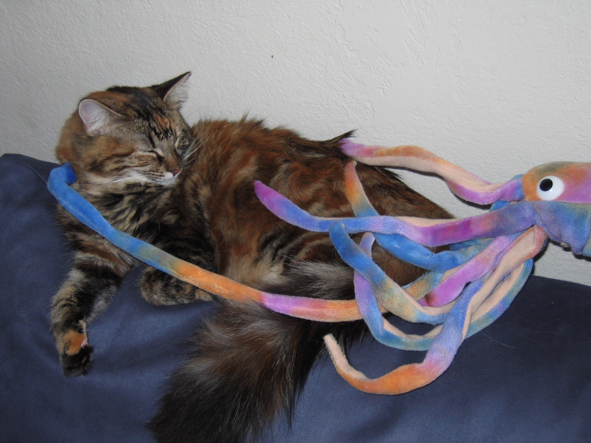
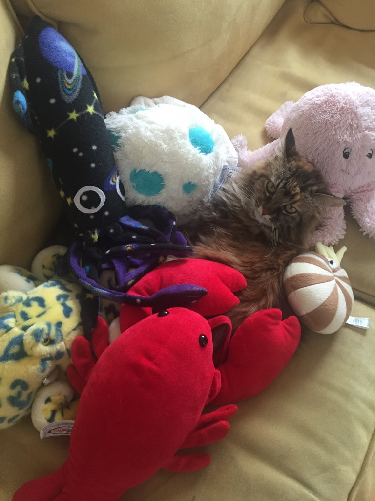
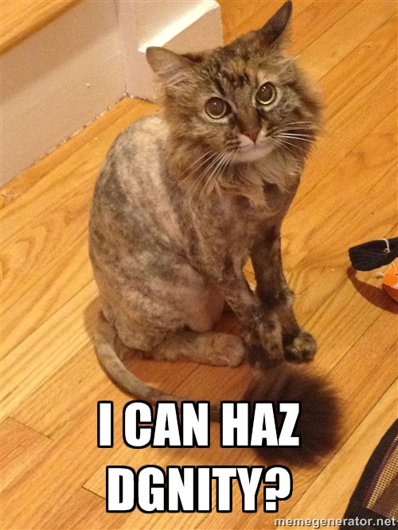
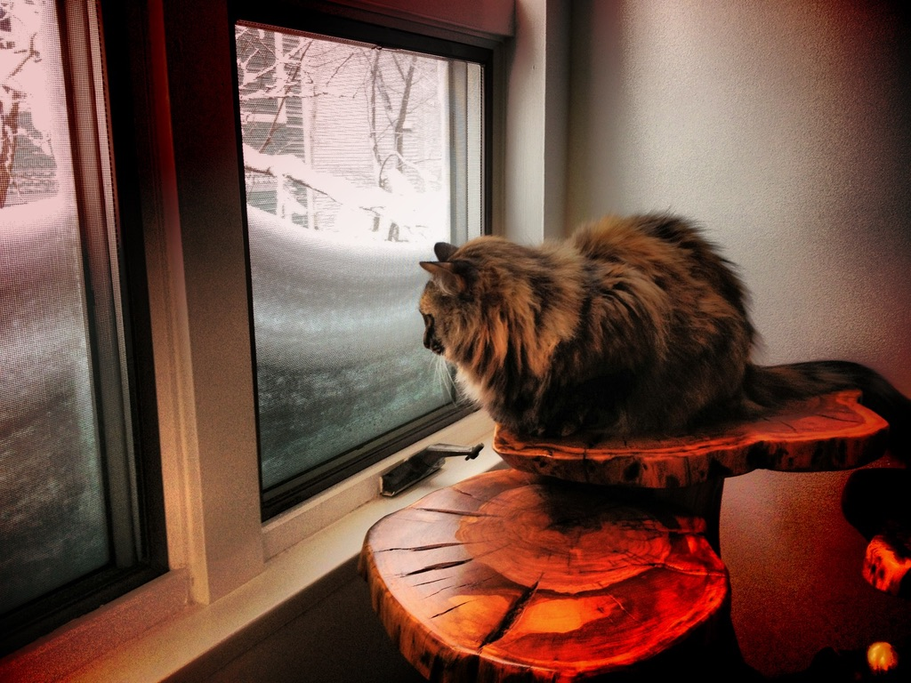

:::{#about}  
:::

Zola was an opera. She was the first cat Jarrett acquired in graduate school, found wandering the streets of Healdsburg. She was dumb as as post. When she would dramatically leap onto a chair, a couch, or a lap, she would forget what and why she was doing mid-jump, arriving at the new spot looking confused and shocked.

{.lightbox}

She was fierce huntress and a fierce lover. A big furry lump who inspired love in all that knew her, because she would attach herself to their laps and purrr loudly.  

::: {layout-ncol=2 layout-valign="center"}

{.lightbox}

{.lightbox}
:::

She passed away a few years ago, but she will always be remembered as the beautiful floof who never ever stopped purring.

{.lightbox}
